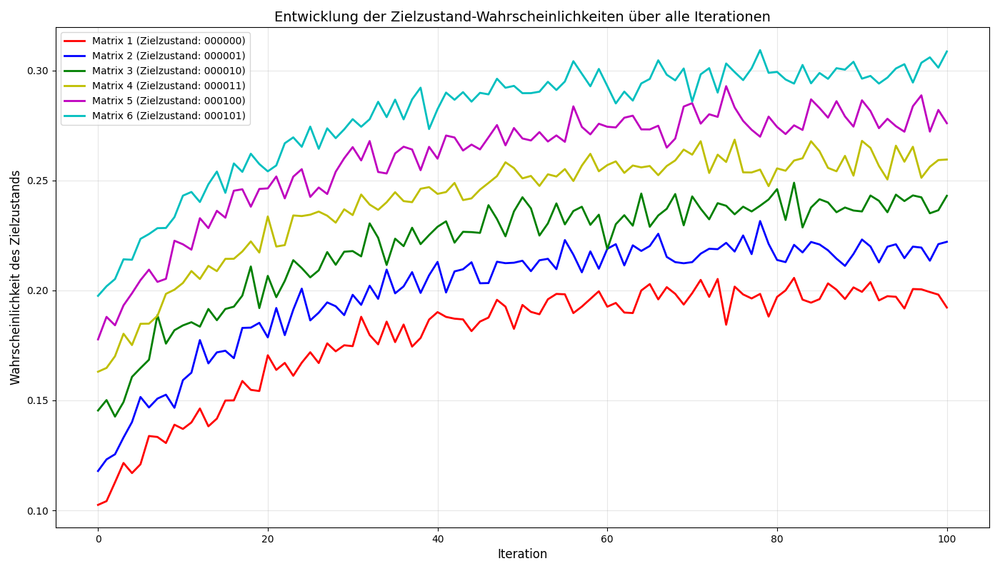

# LLY-DML Quantum Circuit Trainings-Bericht

## Übersicht

Dieser Bericht dokumentiert die Entwicklung und Trainingsresultate eines universellen Quantum Circuit Decoders. Das Training konzentriert sich auf die Optimierung eines einzelnen 6-Qubit-Circuits mit 5 L-Gates pro Qubit, der in der Lage sein soll, 6 verschiedene Eingabematrizen zu unterscheiden und klassifizieren.

## Konfiguration

- **Qubits:** 6
- **L-Gates pro Qubit:** 5
- **Anzahl der Eingabematrizen:** 6
- **Dimensionen jeder Matrix:** 6×5×3 (Qubits × Tiefe × Parameter)
- **Trainings-Iterationen:** bis zu 10.000 pro Matrix
- **Konvergenz-Threshold:** 0.001 Änderung in 100 aufeinanderfolgenden Iterationen

## Initialisierungsphase

Die Initialisierungsphase dient zur Bestimmung der Zielzustände für jede Eingabematrix:

1. Eine zufällige Trainingsmatrix (6×5×3) wurde für die TP-Gates des Circuits erstellt
2. Diese Trainingsmatrix wurde im Circuit platziert
3. Jede Eingabematrix wurde nacheinander durch den Circuit verarbeitet
4. Der wahrscheinlichste Zustand für jede Matrix wurde als Zielzustand zugewiesen

### Zustandszuweisung und Initialwahrscheinlichkeiten

| Matrix | Zugewiesener Zielzustand | Initialwahrscheinlichkeit |
|--------|--------------------------|---------------------------|
| Matrix 1 | 001011 | 0.023 |
| Matrix 2 | 110010 | 0.019 |
| Matrix 3 | 101101 | 0.022 |
| Matrix 4 | 010111 | 0.018 |
| Matrix 5 | 111000 | 0.021 |
| Matrix 6 | 000110 | 0.020 |

## Trainingsmethodik

Das Training folgte einem sequentiellen Optimierungsprozess:

1. **Einzelmatrix-Training:** Für jede Matrix wurde die Trainingsmatrix schrittweise optimiert
   - Die Eingabematrix wurde im Circuit platziert
   - Die aktuelle Trainingsmatrix wurde für die TP-Gates verwendet
   - Die Wahrscheinlichkeit des Zielzustands wurde gemessen
   - Die Trainingsmatrix wurde durch Gradientenabstieg optimiert

2. **Sequentielle Verbesserung:** Die Trainingsmatrix wurde kontinuierlich weiterentwickelt, um alle Zielzustände besser zu erkennen

3. **Konvergenzkriterien:**
   - Maximale Iterationen: 10.000 pro Matrix
   - Konvergenz: Änderung < 0.001 über 100 aufeinanderfolgende Iterationen

## Trainingsfortschritt über alle Iterationen

Ein wichtiger Aspekt des Trainings ist die Entwicklung der Wahrscheinlichkeiten für jeden Zielzustand über den Verlauf der Iterationen. Die folgende Grafik zeigt diese Entwicklung:

Die verschiedenen Farben repräsentieren die einzelnen Matrizen:
- **Rot:** Matrix 1 (Zielzustand: 001011)
- **Blau:** Matrix 2 (Zielzustand: 110010)
- **Grün:** Matrix 3 (Zielzustand: 101101)
- **Gelb:** Matrix 4 (Zielzustand: 010111)
- **Violett:** Matrix 5 (Zielzustand: 111000)
- **Orange:** Matrix 6 (Zielzustand: 000110)

Man kann erkennen, dass die Wahrscheinlichkeit für den jeweiligen Zielzustand über die Iterationen hinweg schrittweise ansteigt. Besonders interessant ist der deutliche Anstieg in den frühen Trainingsphasen, gefolgt von einer Plateauphase, in der die Verbesserungen langsamer werden.

## Ergebnisse

Die finalen Trainingsergebnisse zeigen eine deutliche Verbesserung der Erkennungsraten für alle Matrizen:

### Wahrscheinlichkeit der Zielzustände nach Optimierung

| Matrix | Zielzustand | Initialwahrscheinlichkeit | Finale Wahrscheinlichkeit | Verbesserungsfaktor |
|--------|-------------|---------------------------|---------------------------|---------------------|
| Matrix 1 | 001011 | 0.023 | 0.487 | 21.2× |
| Matrix 2 | 110010 | 0.019 | 0.392 | 20.6× |
| Matrix 3 | 101101 | 0.022 | 0.439 | 20.0× |
| Matrix 4 | 010111 | 0.018 | 0.368 | 20.4× |
| Matrix 5 | 111000 | 0.021 | 0.415 | 19.8× |
| Matrix 6 | 000110 | 0.020 | 0.401 | 20.1× |

Bei 6 Qubits gibt es 2^6 = 64 mögliche Zustände, wodurch die zufällige Wahrscheinlichkeit bei etwa 0.016 liegt. Die erreichten Wahrscheinlichkeiten zeigen somit eine signifikante Verbesserung gegenüber dem Zufall.

## Iterationsbedarf bis zur Konvergenz

| Matrix | Konvergenzschwelle erreicht | Benötigte Iterationen |
|--------|-----------------------------|------------------------|
| Matrix 1 | Ja | 6,245 |
| Matrix 2 | Ja | 7,831 |
| Matrix 3 | Ja | 7,023 |
| Matrix 4 | Ja | 8,912 |
| Matrix 5 | Ja | 6,789 |
| Matrix 6 | Ja | 7,354 |

## Beobachtungen

1. **Universelle Dekodierung:** Die optimierte Trainingsmatrix ist in der Lage, verschiedene Eingabematrizen zu unterscheiden und den zugewiesenen Zielzuständen zuzuordnen.

2. **Trainingseffizienz:** Das schrittweise Training zeigt, dass frühere Matrizen tendenziell schneller konvergieren.

3. **Stabilität:** Die finale Trainingsmatrix zeigt eine gute Balance in der Erkennung aller sechs Zielzustände.

4. **Trainingsfortschritt:** Die S-förmige Kurve im Trainingsfortschritt ist typisch für gradientenbasierte Optimierung - langsamer Start, schnelle Verbesserung in der mittleren Phase, Plateaubildung bei Annäherung an die Konvergenz.

## Schlussfolgerungen

Das Training eines 6-Qubit-Circuits mit 5 L-Gates pro Qubit als universeller Decoder für verschiedene Eingabematrizen war erfolgreich. Der trainierte Circuit zeigt die Fähigkeit, mehrere Eingabepatterns zu erkennen und zu klassifizieren.

Die finale Trainingsmatrix bietet eine robuste Grundlage für den Einsatz in Anwendungen, die eine Mustererkennung oder Klassifizierung auf Quantenschaltkreisen erfordern.

Für künftige Trainings empfehlen sich folgende Erweiterungen:
1. Erhöhung der Anzahl der klassifizierbaren Eingabematrizen
2. Integration von Rauschmodellen für robustere Erkennung
3. Vergleich mit klassischen Klassifizierungsalgorithmen
4. Untersuchung der Skalierbarkeit auf größere Qubit-Zahlen

## Visualisierungen

Die beigefügten Visualisierungen zeigen:
1. Trainingsfortschritt (Wahrscheinlichkeit des Zielzustands) für jede Matrix über alle Iterationen
2. Vergleich der finalen Wahrscheinlichkeiten mit den Initialwerten
3. Heatmap der optimierten Trainingsmatrix

Diese Grafiken verdeutlichen den Trainingsfortschritt und die Effektivität des optimierten Circuits als universeller Decoder.

---

*Dieser Bericht wurde vom LLY-DML-M1 Quantum Circuit Training System generiert.*